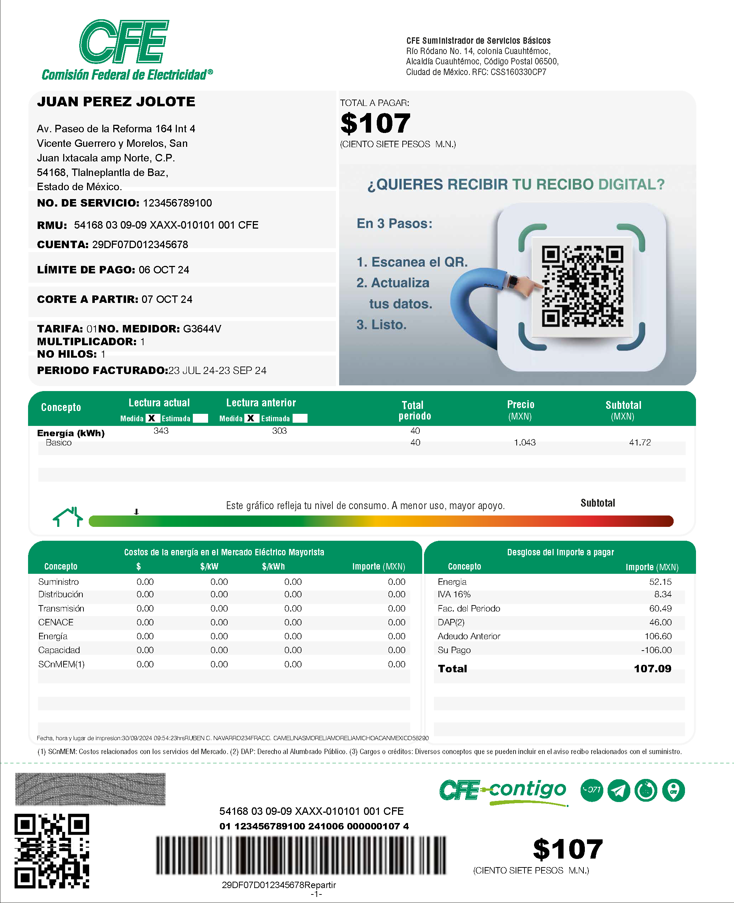

# **Lectura 5.2. Estudio de Caso: Análisis de Datos**

prof. dr. Jesús Zavala Ruiz[^1]

---

## **Introducción**

Para construir el estudio de caso del **servicio de luz** y su digitalización, nos enfocaremos en cómo la **Comisión Federal de Electricidad (CFE)** en México maneja un sistema que parte de la realidad del consumo eléctrico en cada hogar y empresa, y cómo esta realidad se codifica y estructura en datos para crear un recibo de luz, como el mostrado en la Figura 1: 
(Código HTML para desplegar la imagen: 
```text

```

Figura 1. Recibo de Luz de la CFE

(Código HTML para desplegar la imagen: 
```text

```

Figura 1. Recibo de Luz de la CFE

Este recibo es el resultado de un proceso en el que se miden, interpretan y almacenan datos de consumo para informar al usuario y realizar el cobro correspondiente. La narrativa se desarrolla en tres partes: (1) la realidad (el servicio de luz), (2) los datos (la recolección, creación y organización de datos) y (3) validación de los datos (el recibo de luz digitalizado).

## **1. La Realidad: El Consumo Eléctrico y el Servicio de Luz**

### **1.1. Contexto**

La **electricidad** es un recurso esencial en la vida moderna, indispensable para actividades domésticas, comerciales e industriales. En México, la Comisión Federal de Electricidad (CFE) es responsable de suministrar este servicio a millones de hogares y empresas a nivel nacional. La electricidad permite el funcionamiento de electrodomésticos, sistemas de climatización, iluminación y tecnologías de comunicación y entretenimiento. Sin embargo, la provisión de electricidad no es gratuita; implica costos de generación, distribución y mantenimiento de la infraestructura.

Para administrar este servicio, la CFE debe rastrear el **consumo de electricidad** de cada usuario, lo que varía significativamente según factores como el tipo de cliente (doméstico o industrial), las condiciones climáticas y los hábitos de consumo. Este seguimiento permite a la CFE aplicar tarifas ajustadas a los niveles de consumo y ofrecer subsidios en algunos casos, promoviendo el uso eficiente de la energía.

### **1.2. La Necesidad: Cobrar el Servicio de Luz**

El **recibo de luz** es el documento final que permite al usuario visualizar y comprender su consumo eléctrico, al mismo tiempo que actúa como el medio formal de la CFE para realizar el cobro. La creación de este recibo es posible gracias a la **codificación de datos** que transforma las lecturas de consumo y los detalles del usuario en un formato estandarizado. A partir de la información digitalizada, el sistema de la CFE genera automáticamente un recibo que incluye:

   - **Datos del usuario**: Nombre, dirección y número de servicio.
   - **Periodo de facturación**: Inicio y fin del periodo de consumo medido.
   - **Detalles de consumo**: Cantidad de kWh consumidos en cada rango tarifario (básico, intermedio y excedente).
   - **Desglose de costos**: Subtotal del consumo en cada rango tarifario, sumas de impuestos (IVA), y cargos adicionales (como el Derecho de Alumbrado Público - DAP).
   - **Total a pagar**: La suma final que el usuario debe cubrir para saldar su consumo del periodo.

Cada recibo es una **representación digital de la realidad del consumo eléctrico** del usuario. Este documento no solo facilita la recaudación de ingresos para la CFE, sino que también ofrece al usuario una herramienta para monitorear su uso de energía y tomar decisiones informadas sobre su consumo. 

### **1.3. La Necesidad de Digitalización**

El **consumo eléctrico**, aunque es una realidad física, debe traducirse en datos cuantificables para poder ser medido y cobrado. Esta traducción se realiza mediante **medidores eléctricos** instalados en cada punto de servicio (domicilio o empresa). Estos medidores registran el flujo de energía en unidades de kilovatios-hora (kWh), que representan la cantidad de energía consumida durante un periodo específico.

Los datos capturados por el medidor incluyen:
   - **Lectura actual**: El número total de kWh al final del periodo.
   - **Lectura anterior**: El número total de kWh al inicio del periodo.
   - **Consumo del periodo**: La diferencia entre la lectura actual y la anterior.

Además de estos datos, otros factores deben ser codificados:
   - **Tarifa aplicada**: Determinada por el tipo de cliente y nivel de consumo.
   - **Ubicación y tipo de usuario**: Definidos para aplicar tarifas específicas (residencial, comercial, industrial).
   - **Rangos tarifarios**: Segmentos de consumo (básico, intermedio, excedente) que permiten ajustar el cobro según los subsidios y los niveles de uso.

Cada uno de estos elementos es capturado, digitalizado y almacenado en una **base de datos central**. Este proceso de digitalización permite que los datos de millones de usuarios se estructuren en un formato uniforme y se mantengan accesibles para el cálculo de facturas, la generación de estadísticas de consumo y la administración del servicio a nivel nacional.

### **1.4. Ventajas de la Digitalización del Servicio de Luz**

La codificación y digitalización del servicio de luz ofrecen múltiples ventajas:
   - **Eficiencia**: Los datos de consumo de millones de usuarios pueden procesarse y facturarse automáticamente.
   - **Transparencia**: Cada recibo proporciona un desglose claro de cómo se calcula el total a pagar, permitiendo a los usuarios entender sus costos.
   - **Flexibilidad y Personalización**: La CFE puede aplicar diferentes tarifas y subsidios y ajustar el recibo a las características individuales de consumo de cada usuario.
   - **Monitoreo y Análisis**: La base de datos de consumo permite a la CFE monitorear patrones de consumo a nivel regional y temporal, ayudando a planificar la demanda y ajustar la oferta de energía.

## **2. Los Datos: Codificación de los Conceptos**

### **2.1. Contexto**

A continuación se expone un resumen estructurado de los **conceptos de la realidad** que deben ser consignados en la **base de datos central** de la CFE, tal como lo haría un analista de sistemas. Este primer entregable describe los **datos clave** que *representan la realidad* del consumo y los detalles del usuario, y que serán fundamentales para generar el recibo de luz. La lista se basa en el contexto desarrollado en el caso de uso.

### **2.2. Conceptos de la Realidad por Digitalizar**

1. **Información del Cliente y Punto de Servicio**
   - **Número de Servicio**: Identificación única asignada a cada cliente para su facturación.
   - **RMU (Registro Móvil de Usuario)**: Código único que permite rastrear la ubicación y el historial del usuario en el sistema.
   - **Nombre o Razón Social**: Nombre del titular del servicio (persona o entidad).
   - **Dirección de Suministro**: Incluye la calle, número, colonia, ciudad, código postal y entidad federativa.
   - **Tipo de Usuario**: Clasificación del cliente (doméstico, comercial, industrial).
   
2. **Datos de Medición**
   - **Número de Medidor**: Código que identifica el equipo instalado en el domicilio o empresa para medir el consumo eléctrico.
   - **Tipo de Medidor**: Especifica si el medidor es electromecánico o digital.
   - **Lectura Anterior**: Registro de kWh al inicio del periodo de facturación.
   - **Lectura Actual**: Registro de kWh al final del periodo de facturación.
   - **Multiplicador**: Factor aplicado a la lectura para ajustar el cálculo de consumo según el tipo de medidor.

3. **Periodo de Facturación**
   - **Fecha de Inicio del Periodo**: Fecha en que comienza la medición del consumo.
   - **Fecha de Fin del Periodo**: Fecha en que termina la medición del consumo.
   - **Límite de Pago**: Fecha límite para que el usuario realice el pago sin recargos.
   - **Fecha de Corte**: Fecha a partir de la cual se procederá al corte del servicio en caso de impago.

4. **Datos de Consumo**
   - **Consumo por Nivel Tarifario**:
     - **Consumo Básico (kWh)**: kWh consumidos en el rango básico de la tarifa.
     - **Consumo Intermedio (kWh)**: kWh consumidos en el rango intermedio de la tarifa.
     - **Consumo Excedente (kWh)**: kWh consumidos en el rango excedente de la tarifa.
   - **Consumo Total (kWh)**: Suma de los kWh en todos los niveles tarifarios.

5. **Detalle de Costos**
   - **Precio por Nivel Tarifario**:
     - **Precio Básico ($/kWh)**: Costo por kWh en el rango básico.
     - **Precio Intermedio ($/kWh)**: Costo por kWh en el rango intermedio.
     - **Precio Excedente ($/kWh)**: Costo por kWh en el rango excedente.
   - **Subtotal de Consumo**: Total del costo de consumo antes de impuestos y cargos adicionales.
   
6. **Costos de la Energía en el Mercado Mayorista**
   - **Suministro**: Costo por el suministro de electricidad al usuario.
   - **Distribución**: Costo de distribución de electricidad en media y baja tensión.
   - **Transmisión**: Costo por la transmisión de electricidad.
   - **CENACE**: Costo asociado al Centro Nacional de Control de Energía.
   - **Generación**: Costo de generación de electricidad en los diferentes periodos (base, intermedio, punta).
   - **Capacidad**: Costo de capacidad de carga según demanda.
   - **ScnMEM**: Cargos de servicio relacionados con el mercado eléctrico mayorista.
   - **Aportación Gubernamental**: Subsidio del gobierno que reduce el costo total en ciertos casos.

7. **Desglose de Importe a Pagar**
   - **IVA**: Impuesto al Valor Agregado aplicado al subtotal de consumo.
   - **Derecho de Alumbrado Público (DAP)**: Cargo adicional por el uso de alumbrado público.
   - **Cargos y Créditos**: Cualquier otro cargo o crédito adicional aplicado al recibo (e.g., ajustes por redondeo, cargos pendientes de otros periodos).
   - **Adeudo Anterior**: Cantidad pendiente de pagos anteriores.
   - **Pago Anterior**: Pago realizado en el periodo anterior.
   - **Total a Pagar**: Monto final que el usuario debe pagar para el periodo actual.

8. **Información Adicional del Recibo**
   - **Talón de Caja**:
     - **Código de Barras**: Código para realizar el pago en ventanillas de la CFE o bancos.
     - **Canales de Contacto**: Información para que el cliente reporte problemas o levante aclaraciones.
   
   - **Indicador de Consumo**: Gráfico que muestra el nivel de consumo y recomienda medidas de ahorro energético para evitar el paso a la tarifa de alto consumo (DAC).

9. **Catálogo de Cargos y Créditos Adicionales**
   - **Diagnóstico Energético**: Cargo por asesoría para mejorar el consumo energético.
   - **Financiamiento**: Cargo por financiamiento de mejoras en el consumo.
   - **Reconexión**: Cargo por reconexión del servicio después de un corte.
   - **Revisión del Medidor**: Costo de inspección y revisión del funcionamiento del medidor.
   - **Bonificación por Interrupción**: Bonificación por interrupciones en el suministro.
   - **Otros Cargos**: Cualquier otro cargo aplicable (e.g., ajustes de convenios, actualizaciones de demanda).

### **2.3. Tipos de Datos en Sistemas Computacionales**

Antes de presentar el diccionario de datos, es importante comprender los diferentes tipos de datos que se utilizan en sistemas computacionales y cómo se aplican en este caso:

#### **2.3.1. Alfanumérico**

Este tipo de dato puede contener cualquier combinación de letras, números y caracteres especiales. En el contexto del recibo de luz, se utiliza tanto para información descriptiva (nombres, direcciones) como para identificadores únicos.

**Nota**: En sistemas de bases de datos, este tipo suele implementarse como "VARCHAR", "CHAR" o "TEXT", dependiendo de la longitud y características específicas del dato.

#### **2.3.2. Numérico**

Los datos numéricos se dividen principalmente en dos subcategorías:

- **Entero**: Números sin parte decimal, utilizados para conteos y cantidades discretas. En el recibo de luz, ejemplos incluyen el consumo en kWh (cuando no hay fracciones) o el número de días del periodo de facturación.

- **Real**: Números que pueden contener parte decimal, utilizados para mediciones precisas y cálculos. En el recibo, ejemplos incluyen precios por kWh, subtotales y totales monetarios.

**Nota**: En sistemas de bases de datos, los enteros suelen implementarse como "INTEGER" o "INT", mientras que los reales como "DECIMAL", "FLOAT" o "DOUBLE".

#### **2.3.3. Fecha**

Las fechas son un tipo de dato especial que representa un punto específico en el tiempo. Internamente, las computadoras suelen almacenar las fechas como un número entero que representa la cantidad de tiempo transcurrido desde una fecha de referencia (como el 1 de enero de 1970, conocido como "epoch time").

Este almacenamiento numérico permite realizar cálculos con fechas, como:
- Determinar la duración entre dos fechas (por ejemplo, los días en un periodo de facturación)
- Sumar días a una fecha (calcular fechas límite de pago)
- Comparar fechas para ordenar registros cronológicamente

En el recibo de luz, las fechas son cruciales para establecer periodos de facturación, límites de pago y fechas de corte.

**Nota**: En sistemas de bases de datos, las fechas suelen implementarse como "DATE", "DATETIME" o "TIMESTAMP".

#### **2.3.4. BLOB (Binary Large Object)**

Los BLOB son utilizados para almacenar datos binarios como imágenes, archivos o cualquier otro tipo de información que no se representa como texto. En el recibo de luz, se utilizan para almacenar el código de barras y el indicador gráfico de consumo.

La ventaja de los BLOB es que permiten almacenar datos complejos y de gran tamaño dentro de la base de datos, manteniendo la integridad referencial con el resto de los datos.

**Nota**: En sistemas de bases de datos, pueden implementarse como "BLOB", "BINARY" o "VARBINARY".

#### **2.3.5. Lógico (Booleano)**

Los datos lógicos o booleanos solo pueden tener dos valores: verdadero o falso (true/false, 1/0, sí/no). Son útiles para representar estados binarios o condiciones.

En el contexto del recibo de luz, ejemplos de datos lógicos podrían ser:
- **¿Es cliente DAC?**: Indica si el cliente está en tarifa de alto consumo (true/false)
- **¿Lectura estimada?**: Indica si la lectura fue estimada o medida directamente (true/false)
- **¿Tiene adeudos pendientes?**: Indica si el cliente tiene pagos atrasados (true/false)

**Nota**: En sistemas de bases de datos, los booleanos suelen implementarse como "BOOLEAN", "BIT" o a veces como enteros pequeños (TINYINT) donde 0 representa falso y 1 representa verdadero.

### **2.4. Codificación de los Datos y Diccionario de Datos**

La tabla resumen que se muestra a continuación es la lista de conceptos de la realidad que se consignarían en la base de datos central de la CFE, es decir, es el producto de la **codificación de los datos**. Está organizada como un **diccionario de datos**, que relaciona los conceptos de la realidad con su representación simbólica como dato. Por eso, a cada concepto se le ha asignado un nombre corto, llamado "campo" o "Variable", el "Tipo de Dato" y si el valor es "Único" (para aquellos campos que deben ser exclusivos para cada cliente o registro). Además, se incluye un ejemplo concreto tomado del recibo de luz analizado.

| **Concepto**                       | **Variable**                   | **Tipo de Dato** | **Único** | **Descripción** | **Ejemplo** |
|------------------------------------|--------------------------------|------------------|-----------|-----------------|-------------|
| **Número de Servicio**             | num_servicio                   | Alfanumérico     | Sí        | Identificación única asignada a cada cliente. | 123456789100 |
| **RMU (Registro Móvil de Usuario)**| rmu                            | Alfanumérico     | Sí        | Código único para rastrear ubicación e historial del usuario. | 54168 03 09-09 XAXX-010101 001 CFE |
| **Nombre o Razón Social**          | nombre_usuario                 | Alfanumérico     | No        | Nombre del titular del servicio (persona o entidad). | JUAN PEREZ JOLOTE |
| **Dirección de Suministro**        | direccion                      | Alfanumérico     | No        | Dirección completa del suministro eléctrico. | Av. Paseo de la Reforma 164 Int 4, C.P. 54168 |
| **Tipo de Usuario**                | tipo_usuario                   | Alfanumérico     | No        | Clasificación del cliente (doméstico, comercial, industrial). | Doméstico |
| **Número de Medidor**              | num_medidor                    | Alfanumérico     | Sí        | Código que identifica el equipo de medición. | G3644V |
| **Tipo de Medidor**                | tipo_medidor                   | Alfanumérico     | No        | Tipo de medidor (electromecánico o digital). | Digital |
| **Lectura Anterior (kWh)**         | lectura_anterior               | Numérico (Entero)| No        | Valor del medidor al inicio del periodo. | 0 |
| **Lectura Actual (kWh)**           | lectura_actual                 | Numérico (Entero)| No        | Valor del medidor al final del periodo. | 40 |
| **Multiplicador**                  | multiplicador                  | Numérico (Entero)| No        | Factor aplicado a la lectura del medidor. | 1 |
| **Fecha de Inicio del Periodo**    | fecha_inicio_periodo           | Fecha            | No        | Fecha en que comienza el periodo de facturación. | 23/07/2023 |
| **Fecha de Fin del Periodo**       | fecha_fin_periodo              | Fecha            | No        | Fecha en que termina el periodo de facturación. | 23/09/2023 |
| **Límite de Pago**                 | limite_pago                    | Fecha            | No        | Fecha límite para realizar el pago sin recargos. | 06/10/2023 |
| **Fecha de Corte**                 | fecha_corte                    | Fecha            | No        | Fecha a partir de la cual se procederá al corte del servicio. | 07/10/2023 |
| **Consumo Básico (kWh)**           | consumo_basico                 | Numérico (Entero)| No        | kWh consumidos en el rango básico de la tarifa. | 40 |
| **Consumo Intermedio (kWh)**       | consumo_intermedio             | Numérico (Entero)| No        | kWh consumidos en el rango intermedio de la tarifa. | 0 |
| **Consumo Excedente (kWh)**        | consumo_excedente              | Numérico (Entero)| No        | kWh consumidos en el rango excedente de la tarifa. | 0 |
| **Consumo Total (kWh)**            | consumo_total                  | Numérico (Entero)| No        | Suma de los kWh en todos los niveles tarifarios. | 40 |
| **Precio Básico ($/kWh)**          | precio_basico                  | Numérico (Real)  | No        | Costo por kWh en el rango básico. | 1.043 |
| **Precio Intermedio ($/kWh)**      | precio_intermedio              | Numérico (Real)  | No        | Costo por kWh en el rango intermedio. | 1.260 |
| **Precio Excedente ($/kWh)**       | precio_excedente               | Numérico (Real)  | No        | Costo por kWh en el rango excedente. | 3.466 |
| **Subtotal de Consumo**            | subtotal_consumo               | Numérico (Real)  | No        | Total del costo de consumo antes de impuestos. | 41.72 |
| **Suministro**                     | costo_suministro               | Numérico (Real)  | No        | Costo por el suministro de electricidad. | 16.69 |
| **Distribución**                   | costo_distribucion             | Numérico (Real)  | No        | Costo de distribución en media y baja tensión. | 8.34 |
| **Transmisión**                    | costo_transmision              | Numérico (Real)  | No        | Costo por transmisión de electricidad. | 4.17 |
| **CENACE**                         | costo_cenace                   | Numérico (Real)  | No        | Costo asociado al Centro Nacional de Control de Energía. | 0.83 |
| **Generación**                     | costo_generacion               | Numérico (Real)  | No        | Costo de generación de electricidad por periodo. | 10.43 |
| **Capacidad**                      | costo_capacidad                | Numérico (Real)  | No        | Costo de capacidad según la demanda. | 1.25 |
| **ScnMEM**                         | costo_scnmem                   | Numérico (Real)  | No        | Cargos de servicio relacionados con el mercado eléctrico mayorista. | 0.01 |
| **Aportación Gubernamental**       | aportacion_gubernamental       | Numérico (Real)  | No        | Subsidio del gobierno para reducir el costo. | -236.76 |
| **IVA**                            | iva                            | Numérico (Real)  | No        | Impuesto al Valor Agregado sobre el subtotal. | 8.34 |
| **Derecho de Alumbrado Público**   | dap                            | Numérico (Real)  | No        | Cargo adicional para el alumbrado público. | 46.00 |
| **Cargos y Créditos Adicionales**  | cargos_creditos                | Numérico (Real)  | No        | Cargos o créditos adicionales aplicados al recibo. | 0.00 |
| **Adeudo Anterior**                | adeudo_anterior                | Numérico (Real)  | No        | Cantidad pendiente de pagos anteriores. | 106.60 |
| **Pago Anterior**                  | pago_anterior                  | Numérico (Real)  | No        | Pago realizado en el periodo anterior. | 106.00 |
| **Total a Pagar**                  | total_pagar                    | Numérico (Real)  | No        | Monto final que el usuario debe cubrir en el periodo actual. | 107.09 |
| **Código de Barras**               | codigo_barras                  | BLOB             | No        | Código para realizar el pago en ventanillas de la CFE o bancos. | [Imagen del código de barras] |
| **Indicador de Consumo**           | indicador_consumo              | BLOB             | No        | Gráfico que muestra el nivel de consumo en colores. | [Gráfico de semáforo] |
| **Conceptos Adicionales**          | concepto_adicional             | Alfanumérico     | No        | Texto descriptivo de otros cargos y créditos adicionales. | "Ajuste por redondeo" |
| **Es Cliente DAC**                 | es_dac                         | Lógico           | No        | Indica si el cliente está en tarifa de alto consumo. | False |
| **Lectura Estimada**               | es_lectura_estimada            | Lógico           | No        | Indica si la lectura fue estimada o medida directamente. | False |
| **Tiene Adeudos Pendientes**       | tiene_adeudos                  | Lógico           | No        | Indica si el cliente tiene pagos atrasados. | True |

Esta tabla es el primer entregable del **análisis de datos** que se convierte en un **diccionario de datos** para la base de datos central de la CFE, donde se almacenarán los datos de cada cliente y su consumo de electricidad. La estructura permite que el sistema administre de manera eficiente el registro de consumo, la generación de recibos detallados y la aplicación de políticas tarifarias de forma consistente.

Cada campo o Variable representa un aspecto de la realidad del servicio eléctrico, traducido en un dato digital que facilita el seguimiento del consumo, la transparencia en el cobro y el análisis para la optimización de la distribución de energía. 

Con esta base de datos central organizada, la CFE puede gestionar el suministro de electricidad para millones de usuarios, ofreciendo una experiencia de facturación transparente y estructurada que refleja fielmente el consumo real de cada cliente. 

### **2.5. Estructuras de Datos para la Organización de la Información**

Las diferentes secciones identificadas en el recibo pueden considerarse como estructuras de datos complejas que organizan información relacionada. Estas estructuras permiten un manejo más eficiente y coherente de los datos. A continuación, explicamos cómo se manejan estas estructuras:

#### **2.5.1. Registros (Records)**

La información del cliente constituye un **registro** o **record**, que es una colección de campos relacionados que describen una entidad (en este caso, el cliente y su servicio). En lenguajes de programación, esto suele implementarse como una estructura, clase o objeto.

**Ejemplo en pseudocódigo**:
```
TIPO_REGISTRO Cliente = {
    Alfanumérico num_servicio
    Alfanumérico rmu
    Alfanumérico nombre_usuario
    Alfanumérico direccion
    Alfanumérico tipo_usuario
    Alfanumérico num_medidor
}
```

#### **2.5.2. Arreglos (Arrays)**

Los datos históricos de consumo o las lecturas podrían almacenarse como **arreglos**, que son colecciones ordenadas de elementos del mismo tipo. Esto permite acceder a datos históricos o realizar cálculos sobre múltiples periodos.

**Ejemplo en pseudocódigo**:
```
TIPO_ARREGLO HistorialConsumo = [
    {fecha: "JUL-2023", consumo: 35},
    {fecha: "AGO-2023", consumo: 38},
    {fecha: "SEP-2023", consumo: 40}
]
```

#### **2.5.3. Tablas (Relaciones)**

La relación entre clientes, medidores, y consumos se maneja mediante **tablas** en una base de datos relacional. Cada tabla tiene filas (registros) y columnas (campos), y las relaciones se establecen mediante claves primarias y foráneas.

**Ejemplo de estructura relacional**:
```
TABLA Clientes (
    num_servicio ALFANUMÉRICO CLAVE_PRIMARIA,
    nombre_usuario ALFANUMÉRICO,
    direccion ALFANUMÉRICO,
    tipo_usuario ALFANUMÉRICO
)

TABLA Consumos (
    id_consumo ENTERO CLAVE_PRIMARIA,
    num_servicio ALFANUMÉRICO CLAVE_FORÁNEA,
    fecha_inicio FECHA,
    fecha_fin FECHA,
    consumo_total ENTERO,
    monto_total REAL
)
```

#### **2.5.4. Listas (Lists)**

Los conceptos de cobro y cargos adicionales pueden manejarse como **listas**, que son colecciones ordenadas de elementos que pueden variar en número. Esto permite flexibilidad para añadir o quitar conceptos según sea necesario.

**Ejemplo en pseudocódigo**:
```
TIPO_LISTA ConceptosCobro = [
    {concepto: "Consumo Básico", monto: 41.72},
    {concepto: "IVA", monto: 8.34},
    {concepto: "DAP", monto: 46.00}
]
```

#### **2.5.5. Diccionarios (Maps o Associative Arrays)**

Los precios por tarifa o los costos desglosados pueden representarse como **diccionarios** o **mapas**, que son colecciones de pares clave-valor donde cada clave es única.

**Ejemplo en pseudocódigo**:
```
TIPO_DICCIONARIO PreciosPorTarifa = {
    "basico": 1.043,
    "intermedio": 1.260,
    "excedente": 3.466
}
```

Estas estructuras de datos no solo organizan la información de manera lógica, sino que también facilitan las operaciones que se realizan con ellos, como cálculos, búsquedas y actualizaciones. La elección de la estructura adecuada depende de las necesidades específicas del sistema y de cómo se utilizarán los datos.

## **3. El Recibo de Luz: Aplicación y Validación**

### **3.1. Contexto**

El recibo de luz se convierte en el documento que permite cobrar el consumo de luz, logrando el **objetivo de negocio** y validando la precisión del análisis de datos realizado. Este análisis considera las áreas de datos identificadas, los tipos especiales de datos y el tratamiento adecuado de datos alfanuméricos y numéricos para su correcta codificación en la base de datos de la CFE.

### **3.2. Áreas de Datos en el Recibo de Luz**

A partir del recibo mostrado en la [Figura 1](https://github.com/jzavalar/Informatica/blob/main/images/123456789100_Page_1.png), se identificaron varias áreas clave que organizan y presentan información específica. Estas áreas funcionan como **estructuras de datos** dentro del documento, agrupando información relacionada para facilitar su comprensión y procesamiento.

1. **Estructura de Información del Cliente y Servicio**: Agrupa todos los datos que identifican al usuario y su punto de servicio.
   
2. **Estructura de Periodo de Facturación y Fechas Clave**: Organiza las fechas relevantes para el proceso de facturación.
   
3. **Estructura de Datos de Consumo**: Contiene la información sobre lecturas y consumo energético.
   
4. **Estructura de Costos y Desglose de Importe**: Agrupa todos los elementos de costo y su cálculo.
   
5. **Estructura de Talón de Caja**: Organiza la información necesaria para realizar el pago.

Cada una de estas estructuras contiene múltiples campos de datos que ya fueron detallados en el diccionario de datos de la sección 2.4.

### **3.3. Tipos Especiales de Datos**

Dentro de estas áreas, se identificaron varios tipos especiales de datos que deben manejarse de manera específica en la base de datos:

#### **3.3.1. Fechas**
   - **Campos**: 
     - Fecha de Inicio del Periodo: `23 JUL 2023`
     - Fecha de Fin del Periodo: `23 SEP 2023`
     - Límite de Pago: `06 OCT 2023`
     - Fecha de Corte: `07 OCT 2023`
   
   - **Tratamiento computacional**: 
     Las fechas se almacenan internamente como valores numéricos (generalmente como el número de días o segundos desde una fecha de referencia, como el 1 de enero de 1970). Este formato permite realizar operaciones matemáticas como:
     
     - Calcular la duración del periodo: `fecha_fin - fecha_inicio = 62 días`
     - Determinar días para el vencimiento: `limite_pago - fecha_actual`
     - Verificar si una factura está vencida: `IF fecha_actual > limite_pago THEN "Vencida" ELSE "Vigente"`
     
     Para su presentación al usuario, estos valores numéricos se formatean según convenciones locales (DD/MM/AAAA en México).

#### **3.3.2. Listas de Datos o Dataframes**
   - **Consumo por Nivel Tarifario**:
     - **Campos y Valores**: Consumo Básico: `40 kWh`, Precio Básico: `$1.043/kWh`, Subtotal Básico: `$41.72 MXN`
     - **Implementación**: Esta información se maneja como un dataframe o tabla de datos estructurados donde cada fila representa un nivel tarifario y las columnas representan atributos como consumo, precio unitario y subtotal.
   
   - **Costos de la Energía y Desglose de Importe**:
     - **Campos y Valores**:
       - Subtotal de Consumo Básico: `$41.72 MXN`
       - IVA (16%): `$8.34 MXN`
       - Derecho de Alumbrado Público (DAP): `$46.00 MXN`
       - Adeudo Anterior: `$106.60 MXN`
       - Pago Anterior: `$106.00 MXN`
       - Total a Pagar: `$107.09 MXN`
     - **Implementación**: Este desglose se implementa como una lista de elementos de costo, donde cada elemento incluye un concepto, un valor y posiblemente un indicador del tipo de cargo (impuesto, servicio, subsidio).

#### **3.3.3. Datos Lógicos (Booleanos)**

Los siguientes campos lógicos permiten decisiones binarias en el procesamiento del recibo:

1. **Es Cliente DAC**:
   - **Valor**: `False` (en este ejemplo)
   - **Uso**: Determina si al cliente se le aplica la Tarifa de Alto Consumo
   - **Implementación**: Se almacena como un valor booleano (true/false, 1/0)

2. **Lectura Estimada**:
   - **Valor**: `False` (para la lectura actual que es "Medida")
   - **Uso**: Indica si el consumo se calculó basado en estimaciones o en una lectura real
   - **Implementación**: Se almacena como un valor booleano para cada lectura

3. **Tiene Adeudos Pendientes**:
   - **Valor**: `True` (ya que hay un adeudo anterior)
   - **Uso**: Activa advertencias o procesos de cobranza
   - **Implementación**: Se calcula comparando el valor de adeudo_anterior con cero

Estos valores lógicos permiten controles de flujo y decisiones automatizadas en el sistema, como determinar si mostrar avisos de corte o aplicar tarifas especiales.

### **3.4. Identificadores Únicos y Datos Complejos**

En el recibo, algunos campos tienen apariencia alfanumérica pero representan valores únicos y constantes, esenciales para identificar de manera inequívoca al usuario o al equipo de medición:

1. **Número de Servicio**:
   - **Valor**: `123456789100`
   - **Descripción**: Funciona como el identificador único del cliente en la base de datos.
   
2. **Número de Medidor**:
   - **Valor**: `G3644V`
   - **Descripción**: Aunque contiene letras y números, es un identificador único para el equipo de medición del cliente.
   
3. **RMU (Registro Móvil de Usuario)**:
   - **Valor**: `54168 03 09-09 XAXX-010101 001 CFE`
   - **Descripción**: Sirve como identificador constante en el sistema para el usuario.

Estos campos deben definirse como únicos en la base de datos para evitar duplicados y asegurar que cada usuario esté correctamente identificado.

### **3.5. Aplicaciones en Administración Empresarial**

Los conceptos de codificación de datos y estructuración de información vistos en este caso de estudio tienen aplicaciones directas en la administración:

1. **Gestión de clientes y facturación**: Similar al caso de la CFE, las empresas necesitan sistemas robustos para codificar datos de clientes, productos y servicios para generar facturas precisas. La metodología aplicada en este caso puede adaptarse a cualquier empresa que preste servicios recurrentes a sus clientes.

2. **Análisis de consumo y segmentación**: Los datos recopilados permiten análisis de patrones de consumo para:
   - Segmentar clientes según nivel de uso
   - Identificar oportunidades de venta cruzada
   - Optimizar precios y ofertas

3. **Toma de decisiones basada en datos**: La estructuración correcta de datos permite:
   - Proyectar ingresos futuros
   - Planificar recursos según demanda histórica
   - Identificar anomalías y oportunidades de mejora

**Ejemplo práctico**: Una cadena de tiendas departamentales podría aplicar principios similares para analizar las compras de sus clientes con tarjeta de fidelidad:

| **Concepto** | **Variable** | **Tipo de Dato** | **Único** | **Descripción** | **Ejemplo** |
|--------------|--------------|------------------|-----------|-----------------|-------------|
| **ID Cliente** | id_cliente | Alfanumérico | Sí | Identificador único del cliente | TDC-78529463 |
| **Nombre Cliente** | nombre_cliente | Alfanumérico | No | Nombre completo del cliente | María Rodríguez López |
| **Compra Total Mensual** | compra_mensual | Numérico (Real) | No | Monto total de compras en el mes | 3,478.50 |
| **Segmento Cliente** | segmento | Alfanumérico | No | Clasificación del cliente | Platino |
| **Puntos Acumulados** | puntos | Numérico (Entero) | No | Puntos de fidelidad acumulados | 2,340 |
| **Fecha Última Compra** | fecha_ultima_compra | Fecha | No | Fecha de la última transacción | 12/10/2023 |
| **Es Cliente VIP** | es_vip | Lógico | No | Indica si el cliente tiene beneficios VIP | True |

## **4. Conclusiones**

1. La **codificación de datos** transforma la realidad en información accesible y utilizable. El proceso de codificación de datos en un sistema digital convierte el consumo de electricidad, un fenómeno físico continuo, en información estructurada y accesible para el usuario final. Cada dato, desde el número de servicio hasta el consumo en kWh y las fechas de pago, es un reflejo directo de la realidad del uso de energía por parte del cliente. Esta transformación permite a la CFE, administrar grandes volúmenes de datos de manera eficiente y proporcionar a los usuarios una representación detallada y comprensible de su consumo. La digitalización, por tanto, hace que un recurso tan esencial como la electricidad sea monitoreable y gestionable a través de los datos, beneficiando tanto a la administración como a los consumidores.

2. La **organización en áreas de datos** facilita la comprensión y transparencia. Dividir el recibo en áreas de datos (información del cliente, fechas clave, consumo, desglose de costos y talón de caja) permite un diseño de interfaz claro y organizado que facilita la comprensión de la información. Esta organización en áreas bien definidas es una práctica fundamental en el análisis de datos, ya que agrupa elementos similares y los presenta de manera lógica. La transparencia en el desglose de costos y la claridad en la presentación de fechas y detalles de consumo son el resultado directo de esta organización. En el ensayo académico, esta conclusión resalta la importancia de estructurar los datos de forma que sean comprensibles para el usuario, reforzando la confianza en el sistema de facturación y en la empresa que ofrece el servicio.

3. La necesidad de un **tratamiento específico para tipos especiales de datos**. La precisión en el manejo de tipos especiales de datos, como las **fechas** y las **listas de consumos tarifarios** o **costos**, es esencial para el correcto funcionamiento del sistema de información. Las fechas, al estar estandarizadas, permiten cálculos automáticos y ajustes en caso de pagos tardíos o cortes, mientras que las listas de consumo y costos permiten que el sistema desglose el total de manera transparente. El tratamiento adecuado de tipos especiales de datos es un paso crítico en la codificación de la realidad. La digitalización de estos elementos convierte la información en datos manejables y confiables, haciendo que sistemas complejos sean más eficientes y accesibles.

4. Los identificadores únicos como **garantía de integridad y seguimiento**. Los identificadores únicos, como el número de servicio, el RMU y el número de medidor, son fundamentales para la integridad de los datos en la base de datos de la CFE. Estos identificadores aseguran que cada registro esté vinculado de manera precisa al cliente correspondiente, evitando duplicados y errores en el consumo o los cargos. Los identificadores únicos subrayan la importancia de diseñar sistemas de datos que aseguren la integridad y precisión de la información. Esto permite un seguimiento individualizado y confiable, lo cual es esencial en sistemas de datos a gran escala y refuerza la confianza del usuario en la exactitud de la información proporcionada.

5. **La estructura de datos que permite un desglose detallado y estandarizado de datos**, como los costos (como el IVA, el DAP y los costos por nivel de consumo) asegura que el usuario comprenda el origen de cada cargo y confíe en la exactitud del recibo. Esta transparencia es posible gracias a una codificación de datos que integra cada elemento de costo de forma organizada y detallada. Nótese la necesidad de que cualquier sistema de digitalización de la realidad no solo represente fielmente la información, sino que también lo haga de manera transparente y comprensible. La estandarización de cálculos y desgloses permite una experiencia de usuario clara y refuerza la percepción de justicia y precisión en los cargos.

El análisis del recibo de luz como estudio de caso demuestra cómo el proceso de digitalización de la realidad facilita la administración de servicios esenciales mediante sistemas de información. La estructuración adecuada, el tratamiento específico de datos especiales, la transparencia en el desglose de datos vitales como los costos y el uso de identificadores únicos son prácticas clave en la creación de sistemas de datos efectivos. Estas conclusiones subrayan la importancia de la codificación de datos como medio para transformar fenómenos reales en información accesible y precisa, fomentando una relación de confianza entre los usuarios y los sistemas que gestionan estos datos.

## **5. Ejercicios de Aplicación**

### **5.1. Análisis Comparativo**

**Instrucciones**: Examine su propio recibo de luz o cualquier otro recibo de servicios (agua, gas, teléfono) e identifique:
   - ¿Qué campos adicionales o diferentes encuentra respecto al ejemplo estudiado?
   - ¿Cómo clasificaría estos campos según los tipos de datos estudiados?
   - ¿Qué ventajas o desventajas encuentra en la organización de los datos en ese recibo comparado con el caso analizado?

**Entregable**: Elabore una tabla comparativa que incluya al menos 5 campos diferentes, su clasificación por tipo de datos y una breve justificación de su importancia en el contexto del servicio.

### **5.2. Diseño de Base de Datos**

**Instrucciones**: Proponga un esquema simplificado de base de datos para una empresa minorista que necesita facturar productos a clientes, aplicando los principios de codificación vistos.

**Entregable**: Diseñe un diccionario de datos con al menos 15 campos que incluya:
   - Identificadores únicos para clientes y productos
   - Campos para el registro de ventas (fechas, cantidades, precios)
   - Campos para el cálculo de impuestos y descuentos
   - Campos para el seguimiento de pagos

Indique para cada campo: nombre de variable, tipo de dato, si es único o no, descripción y un ejemplo.

### **5.3. Caso Empresarial**

**Instrucciones**: Una empresa de servicios de streaming necesita estructurar datos de consumo de contenido por usuario para implementar un sistema de recomendaciones y facturación personalizada.

**Entregable**: Elabore un informe breve (máximo 2 páginas) que incluya:
   - Identificación de los datos clave que la empresa debe recopilar
   - Propuesta de estructura para almacenar estos datos
   - Explicación de cómo estos datos podrían utilizarse para generar recomendaciones personalizadas y optimizar planes de suscripción
   - Consideraciones éticas y de privacidad en la recopilación y uso de estos datos

**Nota**: Aplique los conceptos de codificación de datos, tipos de datos y organización de información estudiados en este caso.

[^1]: Profesor-investigador del Departamento de Economía de la Universidad Autónoma Metropolitana, Unidad Iztapalapa. Contacto: [jzr@xanum.uam.mx](mailto:jzr@xanum.uam.mx), [Telegram](https://t.me/jzavalar).

Última actualización: 17 de junio de 2025.
